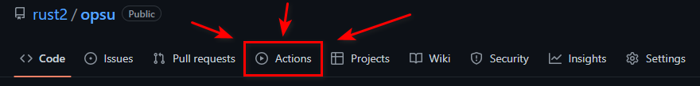
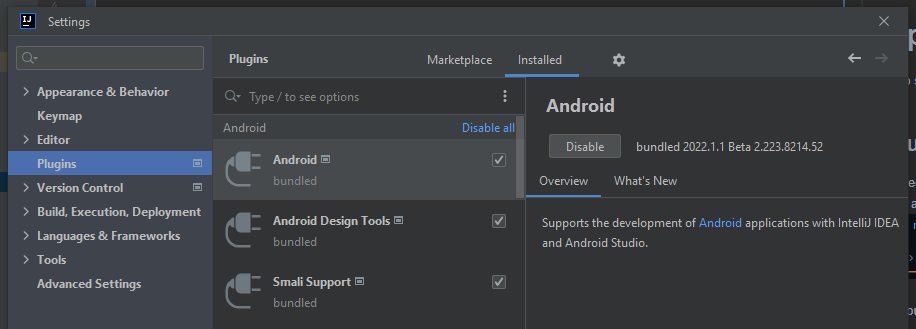

# opsu! ~ an open-source osu! client

A fork of [fork](https://github.com/fluddokt/opsu) of [opsu!](https://github.com/itdelatrisu/opsu) using libgdx to fake Slick2D's API.
I do some shit here. Don't judge me, please.

## Building
Bleeding-edge builds are generated automatically for every commit. You can see them in the actions tab.

If you'd rather compile on your own, follow these instructions.
First, make sure you have at least [JDK 8](https://adoptium.net/temurin/archive/?version=8) installed. Open a terminal in the root directory and run the following commands:

### Windows

_Run:_ `gradlew desktop:run`  
_Build:_ `gradlew desktop:dist`  

### Linux/Mac OS

_Run:_ `./gradlew desktop:run`  
_Build:_ `./gradlew desktop:dist`  

### Android (If you use Intellij IDEA or Android Studio) `//fixme`
#### P.S. I'm noob at this theme...

1. Enable Android plugin

2. When importing a project, IDEA will download needed SDK and platform-tools
3. Set the `ANDROID_HOME` environment variable to point to your unzipped Android SDK directory.
7. Enable developer mode on your device/emulator. If you are on testing on a phone you can follow [these instructions](https://developer.android.com/studio/command-line/adb#Enabling), otherwise you need to google how to enable your emulator's developer mode specifically.
8. Run `gradlew android:assembleDebug` (or `./gradlew` if on linux/mac). This will create an unsigned APK in `android/build/outputs/apk`.

[Credits](https://github.com/fluddokt/opsu/blob/master/CREDITS.md)
-

